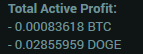

# Fabulous-Poloniex

Fabulous Poloniex is a script giving you the ability to see the total amount of each token (BTC, DASH, LTC, etc.) gained on active loans in real time.

## Getting started

### Install

Requires either [GreaseMonkey](https://addons.mozilla.org/en-US/firefox/addon/greasemonkey/) (FireFox) or [Tampermonkey](https://tampermonkey.net/) (Chrome, Opera, Safari, MSE).

You can use this [YouTube](https://www.youtube.com/watch?v=I1W2p6qLBUI) video or Google [installing userscripts](http://lmgtfy.com/?q=installing+userscripts).

Once you have it installed. Go to your [lending page](https://poloniex.com/lending) and take a look below "My Active Loans". You should see something looking like this:

# Better Content

Let me deliver you better content by dropping me a few tokens of appreciation.

BTC Addy: 18rQ5HzSwaFKvR54CCNhgq7eUDyN84X4Lu

# License

[MIT](https://opensource.org/licenses/GPL-3.0) © [navegacion](https://codepen.io/navegacion/)
